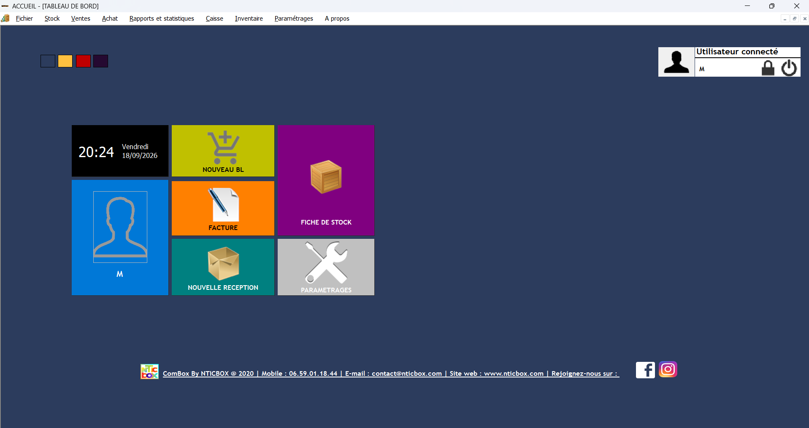
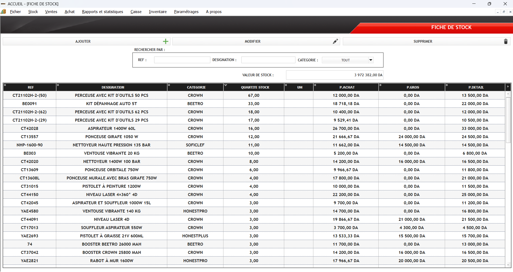
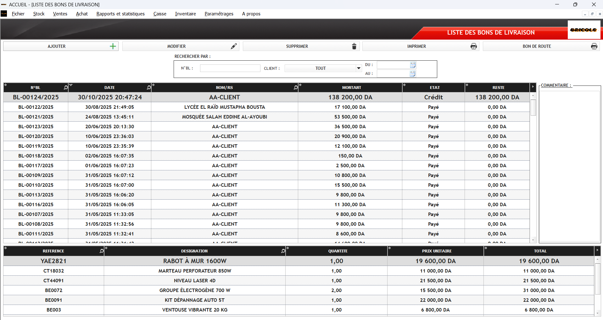
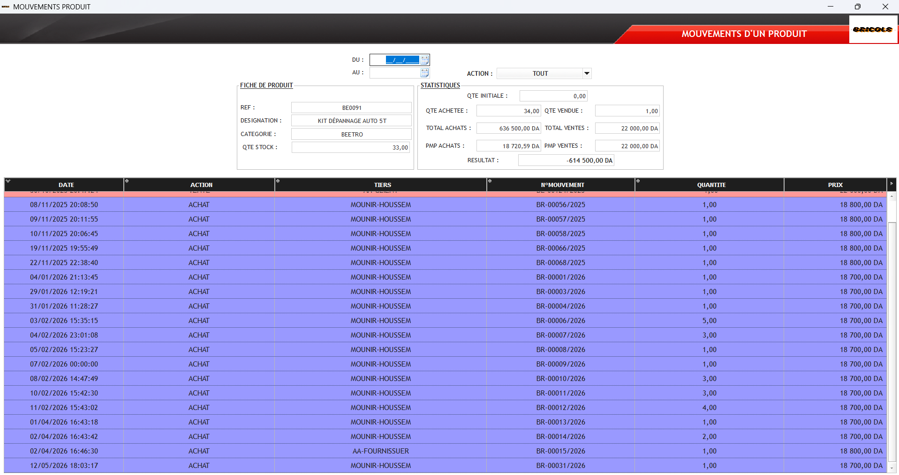
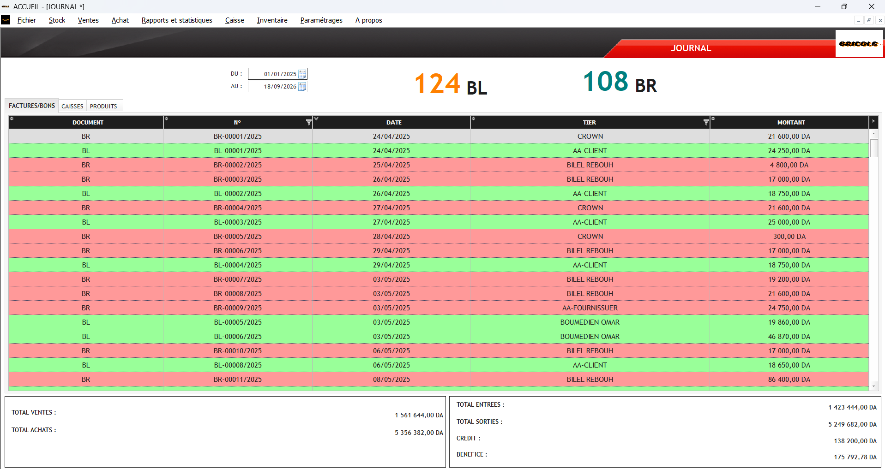

# ComBox — Commercial Management Software

ComBox is a Windows desktop application developed at **NTICBOX** to manage day-to-day commercial operations in one place: products and stock, sales, purchasing, customers, suppliers, cash, inventory and reporting.

I co-developed ComBox with a small three-person software team. Development started around 2017, and the product continued to evolve in later versions. It was commercially deployed and used by **dozens of customers**.

## Product overview

| Area | Details |
|---|---|
| Product type | Commercial management desktop software |
| Organization | NTICBOX |
| My role | Co-development and functional testing of the features/modules I implemented within a three-person software team |
| Technologies | WINDEV / WLanguage, HFSQL |
| Main areas | Stock, sales, purchasing, customers, suppliers, cash, inventory, reporting |
| Product lifecycle | Initial development around 2017, followed by continued evolution and commercial use |
| Deployment | Used by dozens of customers |

## Functional coverage

ComBox brings several connected business workflows into the same application.

| Area | Main capabilities |
|---|---|
| Products & stock | Product catalogue, categories, quantities, units, purchase/wholesale/retail prices, stock value, stock movements |
| Sales & customers | Counter sales, delivery notes, invoices, proforma invoices, customer returns, payments and customer situation |
| Purchasing & suppliers | Receptions/purchases, supplier documents, received items, quantities, prices and supplier follow-up |
| Cash & payments | Cash journal, entries/exits, credit and payment follow-up |
| Inventory | Inventory sessions, data entry, closure and inventory journal |
| Reporting | Commercial journal, document totals, movement history and operational statistics |
| Administration | Users, account settings, product/customer categories, units of measure and company settings |

## My testing contribution

For the features and modules I developed, I also performed developer-led functional testing before they were put into use and as the product evolved.

My checks focused on whether the implemented behavior worked through its intended business flow, including the screens and actions I had developed, the data displayed and stored by those workflows, and their interaction with connected commercial data.

Because ComBox was a team-developed product, this does **not** mean that I was solely responsible for product-wide QA or that I independently tested every module. The testing claim in this case study is limited to the parts I personally implemented and checked.

No separate formal test plan or execution log is published in this repository. This testing description is based on first-hand project context together with the surviving application project and screens.

## Stock and product management

The stock view combines catalogue information with quantities and pricing. Products can be searched by reference, designation or category, while the screen also gives an overall view of stock value.

## Sales and customer documents

Sales workflows include counter sales and commercial documents such as delivery notes, invoices and proforma invoices. Delivery-note screens combine document-level information with the corresponding product lines, quantities and prices.

## Purchasing and receptions

Incoming goods are recorded through reception/purchasing workflows linked to suppliers. The application tracks document numbers, dates, amounts and received line items with quantities and unit prices.

## Product movement history

A dedicated movement view makes it possible to follow a product across purchases and sales. It combines the current stock position with transaction history, counterparties, document numbers, quantities and prices, together with purchase/sales summary indicators.

## Journal, cash and reporting

ComBox also provides consolidated views for commercial activity and cash follow-up. The journal brings together documents, dates, counterparties and amounts, while summary values provide a quick operational picture of purchases, sales, entries, exits, credit and result.

## Technical profile

ComBox is built with **WINDEV / WLanguage** and uses **HFSQL** for its business data. Its modules share product, customer, supplier and transaction information across commercial workflows instead of operating as isolated screens.

The surviving project package contains the native WINDEV application structure and data definitions. This repository presents selected screens and technical documentation rather than the private source project and business database.

## Project evidence

The case study is based on the surviving ComBox project package and screens from working versions of the product. The screenshots published here were selected to show different parts of the application without turning the repository into a full user manual.

More detail:

- [Technical Notes](docs/technical-notes.md)
- [Evidence & Confidentiality](evidence/README.md)
